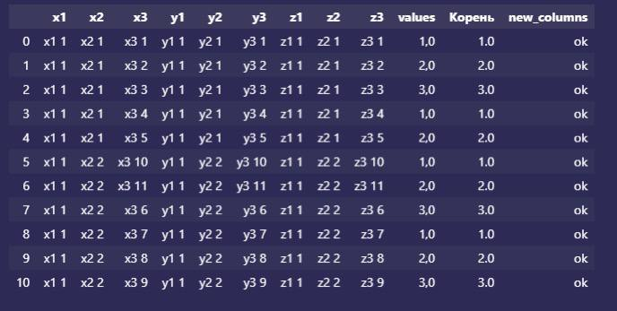

# Test task

### Tasks

- Read the csv (change encoding manually if needed).
- Clean DataFrame, remove empty values in columns if needed.
- Set columns to the correct data type.
- Delete columns if necessary.
- Change column names if necessary.
- Execute
    ```python
    df.groupby(
        ["x1", "x2", "x3", "y1", "y2", "y3", "z1", "z2", "z3", "values"]
    ).sum() #.add_func()
    ```
- Perform a merge of the main DataFrame with df_2.
    ```python
    df_2 = pd.DataFrame({"x1":["x1 1"], "new_columns": "ok"})
    ```
- Save the final DataFrame to `result.csv` in project directory.

### How to run

- Clone repository:
  ```bash
  git clone https://github.com/michaelmatasyants/task.git
  ```
- Crete a new enviornment:
  ```bash
  python3 -m venv venv
  ```
- Install dependencies:
  ```bash
  pip install -r requirements.txt
  ```
- Run the script<br>
  Input:
  ```python
  python3 df_transformation.py
  ```

  Output:
  ```bash
        x1    x2     x3    y1    y2     y3    z1    z2     z3 values  Корень new_columns
  0   x1 1  x2 1   x3 1  y1 1  y2 1   y3 1  z1 1  z2 1   z3 1    1,0     1.0          ok
  1   x1 1  x2 1   x3 2  y1 1  y2 1   y3 2  z1 1  z2 1   z3 2    2,0     2.0          ok
  2   x1 1  x2 1   x3 3  y1 1  y2 1   y3 3  z1 1  z2 1   z3 3    3,0     3.0          ok
  3   x1 1  x2 1   x3 4  y1 1  y2 1   y3 4  z1 1  z2 1   z3 4    1,0     1.0          ok
  4   x1 1  x2 1   x3 5  y1 1  y2 1   y3 5  z1 1  z2 1   z3 5    2,0     2.0          ok
  5   x1 1  x2 2  x3 10  y1 1  y2 2  y3 10  z1 1  z2 2  z3 10    1,0     1.0          ok
  6   x1 1  x2 2  x3 11  y1 1  y2 2  y3 11  z1 1  z2 2  z3 11    2,0     2.0          ok
  7   x1 1  x2 2   x3 6  y1 1  y2 2   y3 6  z1 1  z2 2   z3 6    3,0     3.0          ok
  8   x1 1  x2 2   x3 7  y1 1  y2 2   y3 7  z1 1  z2 2   z3 7    1,0     1.0          ok
  9   x1 1  x2 2   x3 8  y1 1  y2 2   y3 8  z1 1  z2 2   z3 8    2,0     2.0          ok
  10  x1 1  x2 2   x3 9  y1 1  y2 2   y3 9  z1 1  z2 2   z3 9    3,0     3.0          ok
  ```

- Result shown in task:

